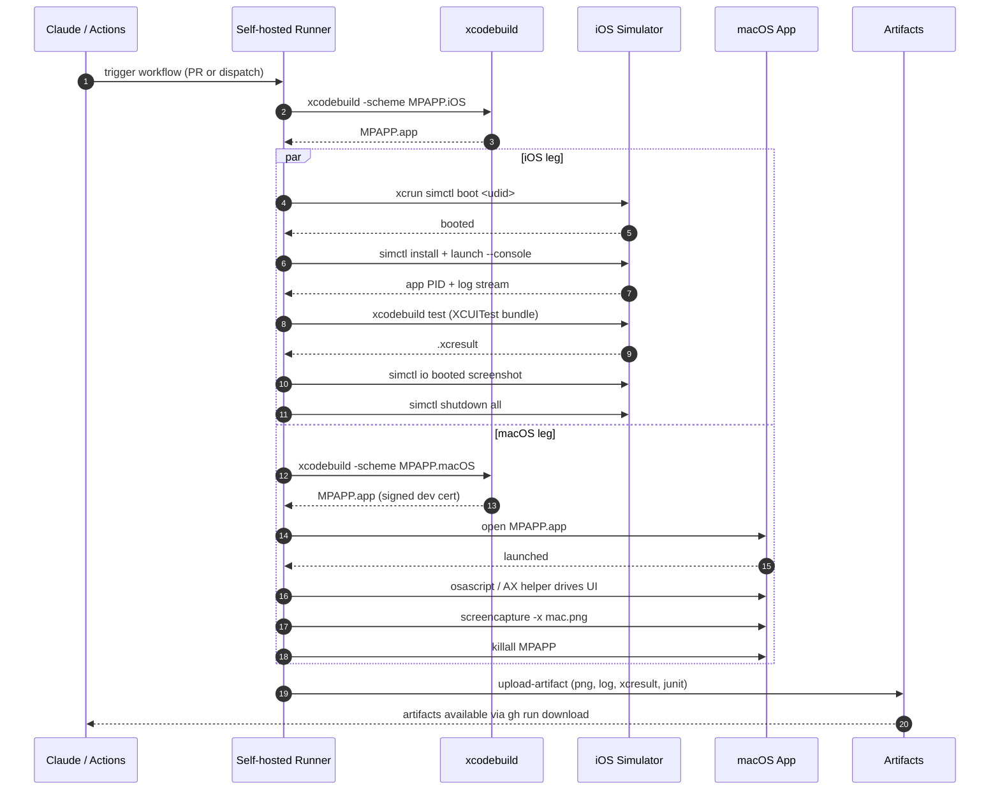

# macOS / iOS Human-Free Test Harness — Design

This note is the design (not the implementation) for the [[Test Harness]] that will let an AI agent iterate on Apple-platform handlers — macOS in [[M-07-macOS-Real]], iOS in [[M-08-iOS-Real]] — once the user's MacBook Pro is online as a self-hosted runner. Implementation lands when M-07 starts; this document is what the implementing task will work from.

It is referenced by [[ADR-0005-ios-macos-separate-interop]] (the separate-interop decision is why this harness must exercise two SDK surfaces) and [[ADR-0007-cross-platform-tooling]] (the harness itself runs on macOS but is invoked from any host via CI).

---

## 1. Goals

The single goal is **human-free iteration**. The MacBook Pro is shared and the human is often unavailable. Any harness step that requires a human click on "Allow", a retyped Keychain password, a dismissed Gatekeeper prompt, or a restart of Xcode adds a multi-hour stall before the agent can read the result.

Concretely the harness must:

- Build, deploy, run, and observe **macOS** binaries and **iOS Simulator** binaries with zero interactive prompts.
- Capture screenshots, logs, and structured pass/fail results as GitHub Actions artifacts so the agent can read them through the normal CI feedback loop.
- Recover from common stuck states (boot hang, signing glitch, full disk, hung XCUITest) without human help.
- Honor [[CI Strategy]]'s budget rules — long Apple jobs only run on the self-hosted runner, never on hosted `macos-latest` minutes except for tagged releases.

> [!info] Why design now
> [[M-02-Infrastructure]] is the right place because the MacBook is expected online *before* M-07. Designing now keeps the implementation task ready to start the moment the runner registers.

Non-goals: physical iPhone deployment, App Store submission, TestFlight, macCatalyst, visionOS. Those land in separate later tasks.

---

## 2. Tooling Stack

Each layer is chosen because it is **scriptable, headless-compatible, and ships with Xcode** — no third-party automation tools, no GUI recorder.

### 2.1 iOS Simulator — `xcrun simctl`

`xcrun simctl` is Apple's first-party Simulator CLI and covers the full lifecycle:

- `simctl create` — deterministic device with a pinned runtime.
- `simctl boot <udid>` — headless boot (no `Simulator.app` window required).
- `simctl install <udid> <app.app>` — install a built `.app`.
- `simctl launch --console <udid> <bundle-id>` — launch and stream stdout/stderr.
- `simctl io booted screenshot output.png` — framebuffer capture.
- `simctl shutdown` / `erase` — recovery primitives (see §5).

### 2.2 macOS UI — AppleScript + Accessibility API

There is no `simctl` equivalent for macOS. Two layers:

1. **AppleScript via `osascript`** drives standard menu items, window state, and the `System Events` Accessibility tree. Cheap, no entitlement, brittle for custom controls.
2. **Accessibility API** via a thin Swift helper (`AXUIElementCopyAttributeValue`, `AXUIElementPerformAction`). Robust for MPAPP custom views, requires the runner user to grant Accessibility permission once.

The harness uses `osascript` for smoke tests and the Swift AX helper for component-level assertions. Both run in the runner's user session — no cross-user automation.

### 2.3 Deep instrumentation — `XCUITest`

For assertions beyond AppleScript's reach (`CollectionView` scrolling, gesture sequences, drag-and-drop), the harness wraps an `XCUITest` target. `xcodebuild test-without-building -destination ...` emits `.xcresult` which `xcresulttool` parses into JSON the agent can read.

### 2.4 GitHub Actions integration

A workflow on the self-hosted runner (`runs-on: [self-hosted, macOS, mpapp-mac1]`) invokes the harness scripts as plain YAML. Outputs (`.png`, `.log`, `.xcresult.zip`, JUnit XML) upload via `actions/upload-artifact`; the agent reads them through `gh run view --log` and `gh run download`.

> [!warning] Keep the workflow boring
> Custom JS actions add a Node.js dependency on the runner and a security review surface. Plain shell + Apple-provided CLIs is enough.

---

## 3. Workflow

End-to-end the harness performs: `app build → boot simulator → install → launch → run UI tests → capture screenshots → teardown → report`.



iOS and macOS legs run in parallel inside the same job — disjoint resources (Simulator process vs. user session) overlap cleanly. Teardown is unconditional via `trap` so a failing test leaves a clean machine.

---

## 4. Self-Hosted Runner Setup

### 4.1 Registration

The MacBook registers via the GitHub Actions runner package (`./config.sh --url ...`) under a **dedicated local user** (`mpapp-ci`), not the human's account. The agent never touches the human's Keychain, Documents, or browser profile.

The runner is a `launchd` user agent (not a system daemon) so it inherits a GUI session — required for `screencapture` and Accessibility-driven tests.

### 4.2 Keychain — dev cert only

A dedicated login keychain (`mpapp-ci.keychain-db`) holds a **development** signing identity and nothing else. Specifically:

- No Apple ID password.
- No distribution certificate.
- No App Store Connect API key.
- No SSH keys to other hosts.

The keychain is unlocked at session start via `security unlock-keychain -p "$RUNNER_KEYCHAIN_PWD"` where the password is injected from a runner-scoped environment file readable only by `mpapp-ci`. Distribution signing — when needed for releases — happens on the human's machine, never the runner.

### 4.3 Auto-restart

A `launchd` plist with `KeepAlive: true, ThrottleInterval: 30` restarts the agent after crashes. A second `launchd` job runs a watchdog every 10 minutes: if `gh api /repos/<repo>/actions/runners` shows the runner `offline`, it `launchctl kickstart -k`s the agent. Three consecutive watchdog failures email the human — the only sanctioned human-loop signal.

### 4.4 Security boundaries

- `runner-group` restricts dispatch to **this repo only**; not shared across organizations.
- Secrets are scoped to the `apple-ci` environment with required reviewers for non-`main` refs, blocking forked-PR exfiltration of the signing identity.
- The runner user has no `sudo` and no admin group membership.
- Outbound network is open (CocoaPods, SPM, GitHub); inbound is firewalled to SSH from the human's LAN only.

> [!warning] Forked PRs
> Fork pull requests must **not** auto-run on the self-hosted runner. `pull_request_target` is dangerous; the harness uses `pull_request` with `if: github.event.pull_request.head.repo.full_name == github.repository` so external PRs require a maintainer to re-dispatch.

---

## 5. Recovery Flow

Apple toolchains have well-known stuck states. The harness handles each with a specific, idempotent recovery primitive.

| Symptom | Detection | Recovery |
|---|---|---|
| Simulator stuck booting | `simctl bootstatus` timeout (default 120s) | `xcrun simctl shutdown all && xcrun simctl erase all` then re-create the test device from snapshot |
| Hung XCUITest | wall-clock timeout (300s default) exceeds + no log output for 60s | kill the entire process tree via `pkill -TERM -P $XCODEBUILD_PID` then `-KILL` after 10s |
| Disk full (`No space left on device`) | `df -h /` < 5 GB free | `rm -rf ~/Library/Developer/Xcode/DerivedData/* ~/Library/Developer/CoreSimulator/Caches/*` and unbooted simulator devices via `xcrun simctl delete unavailable` |
| Hung `Simulator.app` GUI | `pgrep Simulator` present after `shutdown all` | `killall -9 Simulator com.apple.CoreSimulator.CoreSimulatorService` then `launchctl kickstart -k system/com.apple.CoreSimulator.CoreSimulatorService` |
| Keychain locked mid-run | `codesign` returns `errSecAuthFailed` | re-run `security unlock-keychain` once; if it fails a second time, fail the job and ping watchdog |
| Stale Accessibility daemon | AppleScript `osascript` hangs > 30s | `killall cfprefsd` and re-issue; persistent failure escalates to runner restart |

Every recovery primitive is logged with a structured event so the agent can see in the artifact whether a flake was self-healed.

---

## 6. Screenshot Capture

Two paths:

- **iOS Simulator**: `xcrun simctl io booted screenshot --type=png screenshots/ios-<name>.png`. This grabs the framebuffer directly, works headless, and is unaffected by window occlusion.
- **macOS**: `screencapture -x -t png -o -R<rect> screenshots/mac-<name>.png`. `-x` suppresses the shutter sound; `-o` removes the window shadow; `-R` captures a specific rect computed from the app window's Accessibility frame so the screenshot is stable across runner display resolutions.

Naming convention: `<platform>-<scenario>-<step>.png`. Each screenshot is also recorded in a `screenshots.json` manifest with the test name and timestamp so the artifact viewer can render a per-test gallery.

Artifacts upload step:

```yaml
- uses: actions/upload-artifact@v4
  if: always()
  with:
    name: apple-ui-${{ github.run_id }}
    path: |
      screenshots/**
      logs/**
      *.xcresult.zip
      junit.xml
    retention-days: 14
```

`if: always()` is critical — screenshots are most valuable on failure, when the default `success`-only behavior would discard them.

---

## 7. Failure Modes

Each mode below has a deterministic resolution. The harness never silently retries — it logs, attempts the resolution once, and either passes or fails the job with a structured error.

### 7.1 Simulator boot failure

`simctl boot` returns non-zero or `bootstatus` times out. Resolution: full `shutdown all && erase all`, then re-create the device from the pinned runtime/device-type pair. If the second boot fails, the runtime image itself is suspect — log `xcrun simctl runtime list` and fail with `SIM-BOOT-FATAL` for the agent to escalate.

### 7.2 Code-signing failure

`codesign` reports `errSecInternalComponent` or `no identity found`. Resolution: unlock keychain, re-run. Persistent failure means the dev certificate is expired or absent — the harness checks `security find-identity -p codesigning -v` at job start so the failure surfaces early, not after a long build.

### 7.3 Accessibility-permission grant missing

Driving UI through AppleScript / AX requires the runner's Terminal (or the harness binary) to be in **System Settings → Privacy → Accessibility**. This grant cannot be scripted via `tccutil` on modern macOS without disabling SIP — which we will not do. Instead, the runner setup runbook lists this as a one-time bootstrap step, and the harness self-checks at start via a small AX probe (`AXIsProcessTrustedWithOptions`). Missing grant fails fast with `AX-NOT-GRANTED` and a runbook link in the log.

### 7.4 App launch timeout

`simctl launch` returns a PID but the app never reaches a "ready" log line (the MPAPP test apps emit `MPAPP-READY` to stdout on first frame). 30-second wall timeout. Resolution: capture `simctl spawn booted log show --last 1m` to artifacts and fail with `LAUNCH-TIMEOUT`. macOS path equivalent: poll the app's AX root every 500 ms.

### 7.5 Test assertion failure

The expected, non-pathological case. XCUITest produces a `.xcresult` with failure attachments; the harness converts to JUnit XML for GitHub's check annotations and uploads the bundle for deep inspection. No retry — flake suppression is an explicit anti-goal at this layer; flakes are bugs.

### 7.6 Network unreachable (localhost)

Some tests hit a localhost mock server. If `curl http://127.0.0.1:<port>/health` fails before the test starts, the harness re-launches the mock once. If still down, fail with `MOCK-UNREACHABLE` — almost always a port collision with a previous run that did not tear down. The recovery loop logs `lsof -i :<port>` to identify the culprit.

---

## 8. Implementation Effort Breakdown

Subtasks in roughly the order they must land. Complexity is S / M / L per CLAUDE.md Rule 3 — no time estimates.

| # | Subtask | Complexity | Notes |
|---|---|---|---|
| 1 | Runner provisioning runbook + bootstrap script | S | Shell script + Markdown; one-time human action list |
| 2 | `launchd` plists for runner + watchdog | S | Two plists, idempotent installer |
| 3 | Keychain + signing identity setup script | M | `security` CLI dance, careful around interactive prompts |
| 4 | iOS Simulator wrapper (`hr-ios.sh`) | M | Wraps create/boot/install/launch/screenshot/teardown |
| 5 | macOS app wrapper (`hr-mac.sh`) | M | `open`, AX probe, `screencapture`, kill |
| 6 | AppleScript / AX Swift helper library | L | Reusable selectors, retries, AX trust check |
| 7 | XCUITest harness target template | M | Scheme + base test class with screenshot hooks |
| 8 | `.xcresult` → JUnit converter | S | `xcresulttool` JSON → XML |
| 9 | GitHub Actions workflow (`apple-ui.yml`) | M | Matrix per platform, artifact upload, fork guard |
| 10 | Recovery primitives library | M | The §5 table as a single script with `--recover <symptom>` |
| 11 | Self-test workflow exercising every recovery path | L | Deliberately stuck scenarios; gated to nightly |
| 12 | Runbook for human-loop escalation | S | Markdown checklist for the three watchdog cases |

Critical path is 1 → 2 → 3 → 4/5 → 9. Items 6, 7, 10, 11 can land incrementally as M-07 / M-08 work demands them.

---

## 9. Risks

> [!warning] Apple SDK upgrades break the harness
> Each Xcode major version has historically renamed `simctl` flags or changed `.xcresult` schema. Mitigation: pin Xcode via `xcode-select` to a tested version per CI run; bump deliberately in a single PR that updates the harness alongside.

> [!warning] Runner connectivity flakiness
> Home internet is not a datacenter. Mitigation: watchdog with auto-restart, dual paths (Ethernet + Wi-Fi) on the MacBook, and the agent must treat `runner offline` as a transient error rather than a build failure.

> [!warning] Gatekeeper / SIP
> Dev-signed binaries on a fresh macOS install can hit Gatekeeper quarantine if downloaded via certain APIs. Mitigation: builds happen on the runner itself (no quarantine attribute), and the harness asserts `xattr -p com.apple.quarantine` is unset before launch. SIP stays **on** — the harness must never require its disablement.

> [!info] Battery / sleep
> The MacBook must not sleep mid-job. `caffeinate -dimsu` wraps the runner agent at the `launchd` level; the lid-closed-clamshell-mode setup is documented in the runbook.

---

## 10. Open Questions

> [!todo] iOS device vs Simulator parity
> Some bugs only reproduce on real silicon (Metal, Core Haptics). Do we add a tethered iPhone path in a follow-up task, or accept Simulator-only coverage through M-08? Defer to the M-08 kickoff.

> [!todo] Snapshot baselines for visual regression
> Pixel-diff screenshots against a baseline is appealing but explodes the artifact size and is anti-aliasing-sensitive. Adopt now, defer, or rely on AX-tree diffs? Likely an RFC after M-07's first handler lands.

> [!todo] macOS Accessibility permission persistence
> Across macOS upgrades, the Accessibility grant can be revoked. Should the harness fail-fast with a clear runbook or attempt any auto-recovery? Current plan: fail-fast, but revisit if it bites more than twice.

> [!todo] Shared runner with [[M-05-Android-Real]]?
> The Android emulator harness in [[CI Strategy]] could share the same physical MacBook if the M1+ chip handles both workloads. Decision deferred until Android harness numbers exist.

---

## Links

- [[ADR-0005-ios-macos-separate-interop]]
- [[ADR-0007-cross-platform-tooling]]
- [[Test Harness]]
- [[CI Strategy]]
- [[M-07-macOS-Real]]
- [[M-08-iOS-Real]]
